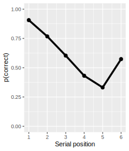
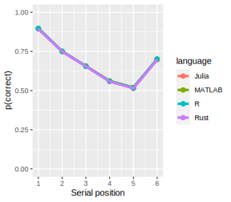
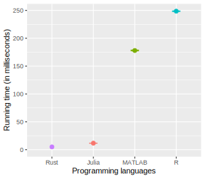

# Benchmarking a model of memory

## Purpose 

This project aims at benchmarking a memory model using different programming languages. How fast do different programming languages perform according to simple, but realistically contrained rules?

The memory model is simple enough to get a sense of what is going on under the shell. Nevertheless, these resutls have pratical implications for researchers. As the computational resources required to run modern mathematical models increase dramatically, the question arises: Which programming language should we use to implement our psychological theories in a mathematical form?

## Model presentation

The model presented here is a model of short-term or working memory. In short, working memory is our capacity to temporarily maintain and manipulate information over a brief period of time. The model presented is the Primacy Model developped by [Pages and Norris in 1998](https://doi.org/10.1037/0033-295X.105.4.761-781). The model has the following characteristics:

1. Each item is encoded into memory following a primacy gradient of activation. The first encoded item receives the strongest activation. The activation received by the subsequent items decreases linearly for each encoding step.
2. Items are retrieved based on their activation level, such that highly activated items have a higher probability to be retrieved.
3. Selection of retrieval candidates is a stochastic process. This is implemented by adding Gaussian noise to items' activation level.
4. The act of retrieving an item decreases the activation level of subsequent items by some constant proportions.
5. After recalling an item, its activation level is suppressed, a phenomenon also called *response suppression*. without it, the model would continuously get stuck on the same item over an over again.

The original primacy model makes other assumptions not implemented here to keep the model simple.

With this model at hand, we can simulate very simple experimental conditions where people's memory is tested. A standard case in the memory literature is when people are given a few words to remember (i.e., generaly 6) and asked to recall them back in their order of presentation. People's performance is surprinsingly poor in this situation, as can be seen in the following figure:

The Y axis represents recall performance across serial positon. In other words, it plots memory performance for each item in the list, averaged across the whole experiment. We can see that memory performance gets worse as more items are recalled, a phenomenon also called the *primacy effect*. Memory performance increases a little bit for the last presented item, a phenomenon called the *recency effect*. A good memory model should capture these basic phenomena.

## Implementation

The model was implemented in [Rust](https://www.rust-lang.org/), [Julia](https://julialang.org/), [MATLAB](https://ch.mathworks.com/) and [R](https://www.r-project.org/). For each implementation, there is room for optimization. The whole idea of this project is to compare different programming languages using a sensibly similar implementations. For instance, the primacy model could be implemented using a closed-form expression instead of an unecessarily inefficient simulated version. But many memory models don't have a closed-form expression and must be simulated. These are the most resource-demanding models. The current benchmarking project represents an artificial situation for such a case, where a lot of computational power is required.

To benchmark the model across all programming languages, I recorded the time it took for each model to run across 10^4 simulations. This process was repeated 10^3 times to reduce the variability in the sampling process.

## Results

The results illustrated in the figure below show the output by the model. Outputs across languages is plotted using different color lines.

As shown in this graph, the model can capture people's behavior reasonably well, including the primacy and recency effects. More importantly for our purpose, all implementations produced similar outputs, as indicated by the overlapping datapoints.

How well did each programming language perform? As can be seen in the following figure, Rust and Julia performed the task relatively quickly, althought Julia took twice as much time as Rust. MATLAB and R, in contrast, need a substantially longer time to run the simulation.

Even though these different programming languages are not equal in terms of run speed, the time spent programming the model must also be accounted for. By far, Julia, MATLAB and R took me 10 to 20 minutes of coding. I needed at least one or two hours to code in Rust. Note that Rust is the programming language I am the last familiar with. I report below the averaged running times:

|   | Mean |
|---|---|
| Rust  | **5.333**  |
| Julia  | 11.665  |
| MATLAB  | 178.032  |
| R  | 248.575  |

Do you want to contribute to this project? Feel free to re-use the code and/or <a h ref = mailto:kowialiewskib@gmail.com>contact me</a>.

## Conclusion

MATLAB and R appear to be outdated languages when performance matters. The Julia and Rust programming languages, in contrast, outperformed the other two. If the time of developement is a critical factor to take into account, Julia, with it's easy-to-learn syntax, appears to be a reasonable alternative to run computational models.